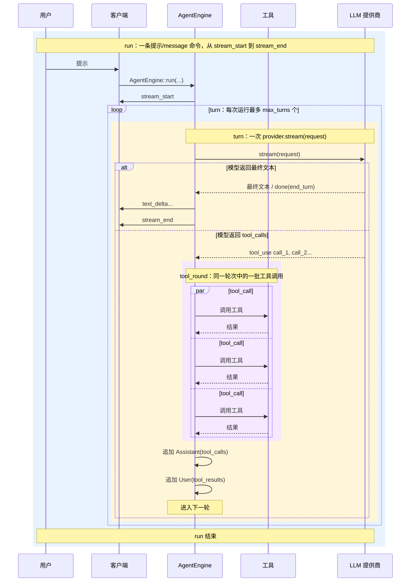

# 核心概念

本文定义 TjuaeCLI 使用的运行时单位。用户可见的协议事件、模型调用和工具执行工作
在不同层级，因此必须准确区分这些术语。

## 运行时单位

| 术语 | 含义 |
|------|------|
| **运行（Run）** | 一条用户提示或宿主 `message` 命令，从 `stream_start` 开始，到 `stream_end` 结束，对应一次 `AgentEngine::run(...)` 执行。 |
| **轮次（Turn）** | 一次运行中的一轮 LLM 往返：构建请求、调用 `provider.stream(...)`、消费响应流。 |
| **工具轮次（Tool round）** | 一个模型轮次可选请求的一批工具工作。每个轮次包含零个或一个工具轮次。 |
| **工具调用 + 工具结果** | 一条工具请求和返回给模型的对应工具结果。 |

数量关系如下：

```text
run 1:N turn
turn 0:1 tool_round
tool_round 1:N tool_call_result_pair
tool_call_result_pair = tool_call + tool_result
```

内部循环是一次运行中的实现细节。它会不断执行模型轮次，直到模型给出最终答案、
用户中止，或运行时保护条件终止本次运行。

## 时序图



## 示例

若用户要求 TjuaeCLI 检查并编辑一个文件，一次运行可能包含：

```text
轮次 1：
  模型请求 Read 和 Grep。
  引擎执行一个工具轮次，其中有两组工具调用/结果。

轮次 2：
  模型请求 Edit。
  引擎执行一个工具轮次，其中有一组工具调用/结果。

轮次 3：
  模型返回最终文本，不再调用工具。
  引擎发出 stream_end。
```

这次运行共包含：

```text
模型轮次：3
工具轮次：2
工具调用/结果组：3
```

## 运行时限制语义

`max_turns` 是一次运行避免无法收敛的总体限制。默认不设置，因此除非显式配置，
运行不会受到总体模型轮次限制：

```toml
max_turns = 20
```

含义是：

```text
每次运行最多 20 个模型轮次
```

省略 `max_turns` 或设置 `max_turns = 0` 会禁用该总体轮次限制。

该限制作用于模型轮次，而不是单个工具调用。若一个轮次请求三个工具，则消耗：

```text
模型轮次：1
工具轮次：1
工具调用/结果组：3
```

这样既不会让耗时较长但有效的工具批次过快耗尽轮次预算，又能限制一次运行中的模型
往返次数。

## 公共名称

| 名称 | 含义 |
|------|------|
| `max_turns` | 每次运行允许的最大模型轮次数。 |
| `AgentResult.turns` | 本次运行中计数的普通轮次数。 |
| `StopReason::MaxTurns` | 本次运行达到轮次上限。 |
| 终端输出 `[轮次：N ...]` | 本次运行已经完成的模型轮次数。 |
